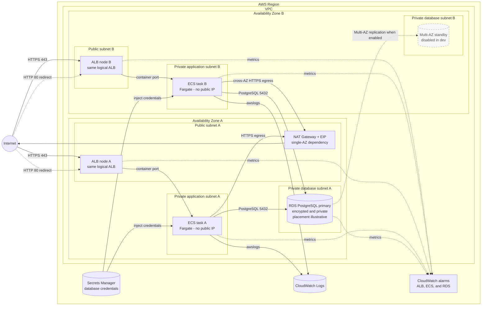

# Architecture

The two ALB nodes represent one logical Application Load Balancer spanning both public subnets. The two tasks represent the ECS service's default desired count of two with Availability Zone rebalancing enabled. Security groups restrict ALB-to-task traffic to the container port and task-to-database traffic to PostgreSQL 5432.

The RDS primary placement is illustrative because AWS selects a subnet from the database subnet group. The dev example sets `db_multi_az = false`, so the dashed standby is not deployed unless Multi-AZ is enabled. Both database subnets have no default internet route. The single NAT Gateway in AZ A is an intentional cost trade-off and an outbound dependency for tasks in both AZs.
